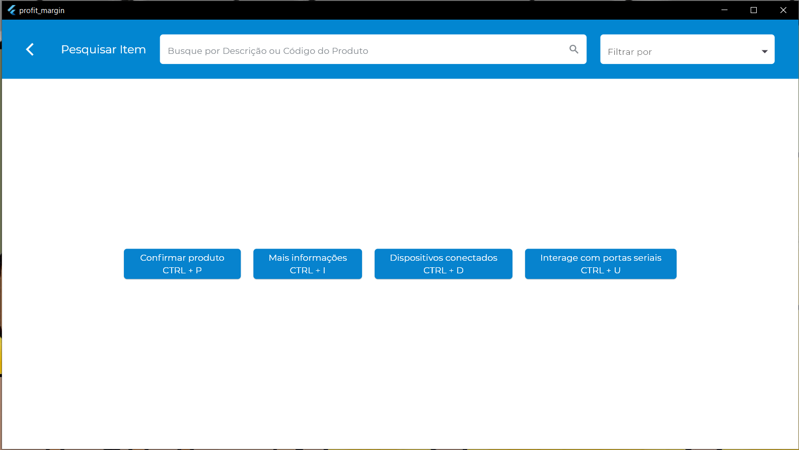

# Sobre verifica sobre comunicação serial USB

**Objetivo:** `profit_margin` é uma (POC) para validar uma demanda em ambiente desktop usando Flutter.

**O que tem:** 
- Leitor de comandos no teclado
- Comunicação serial USB 
- Design da tela do projeto verifica sobre comunicação serial USB

**Pendências:**
- Ajuste na UI
- Ajuste no código
- Melhoria na leitura e escrita na comunicação serial
## Screen

## Instalação e Configuração 

Para instalar o Flutter, siga os passos abaixo:

1. **Download do Flutter**: Acesse o [link](https://docs.flutter.dev/get-started/install/windows/desktop?tab=download) e extraia o SDK para o diretório raiz (`Disco Local (C:)`).

2. **Adicione ao Path**: Adicione o caminho `C:\flutter\bin` às variáveis de ambiente do sistema. Veja como fazer [aqui](https://support.microsoft.com/pt-br/topic/como-gerenciar-vari%C3%A1veis-de-ambiente-no-windows-xp-5bf6725b-655e-151c-0b55-9a8c9c7f747d#:~:text=Para%20exibir%20ou%20alterar%20vari%C3%A1veis,Clique%20em%20Vari%C3%A1veis%20de%20ambiente.).

3. **Execução**: No prompt de comando em modo administrador, execute `flutter doctor` para verificar o que está faltando para executar o Flutter. A ideia é que o resultado seja semelhante a este:

## Build da Aplicação

Após baixar o repositório [profit_margin](), execute os seguintes comandos:

### Reconstrução do Projeto
- `flutter clean`
- `flutter build windows`
- `flutter run`

### Instalando dependências:
- `flutter pub get`

### Atualizando dependências:
- `flutter pub upgrade`

### Verificando atualização de dependências:
- `flutter pub outdated`
